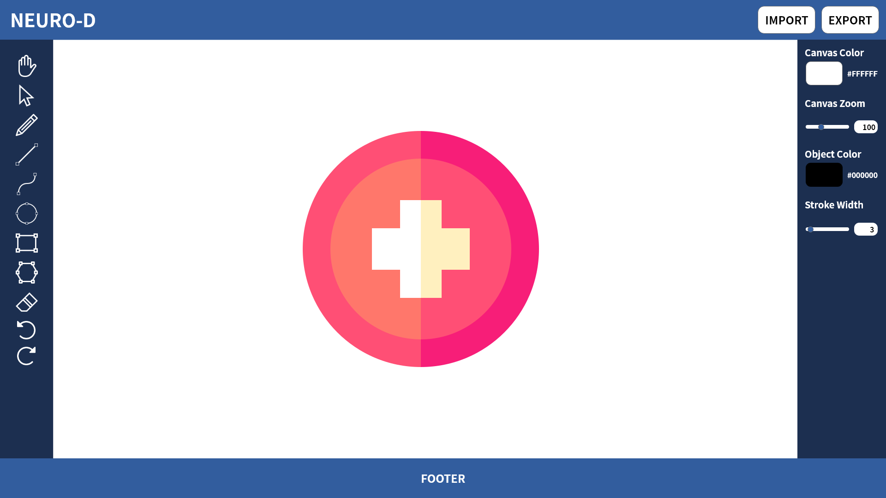

# 프로젝트 Neuro-D

## 프로젝트 과제

- 면접 과제: '**벡터 기반의 드로잉 툴 구현**(원하는 언어 사용 가능)'
- 아래 기능들을 참고하여 구현 가능한 수준에서 자유롭게 구현하시면 되며, 구현 시 관련 라이브러리를 사용하셔도 됩니다.
  1. 드로잉 타입 선택: 직선, 곡선, 원, 직사각형, 다각형 등
  2. 선 두께 선택 // 컬러 선택 // 지우개 // Undo, Redo
  3. Zoom In, Zoom Out
  4. 이미지 불러오기 저장하기

- 제출기한 : 12/29(화) 오후 11:59까지
- 제출방법: 개인 Github에 소스코드 업로드 후 Github 주소를 [neurocle@neuro-cle.com](mailto:neurocle@neuro-cle.com) 으로 송부

## 프로젝트 순서

1. 관련 내용 학습
2. 기능 명세
3. 와이어프레임
4. 환경 세팅
5. 개발
6. 테스트
7. 배포 및 README 정리
8. 제출

## 기능 명세

#### 벡터 이미지 그리기

- [x] 직선
- [x] 곡선
- [x] 원
- [x] 직사각형
- [x] 다각형
- [ ] (다양한 모양의 도형)
- [x] (프리핸드-마우스)
- [ ] (텍스트)
- [ ] (이미지 import)

#### 벡터 이미지 편집 옵션

- [ ] (이미지 객체 선택)
- [ ] (이미지 객체 움직이기)
- [ ] (이미지 객체 크기, 비율 조정)
- [ ] (이미지 객체 레이어 순서 조정)
- [x] (캔버스 색 변경)
- [x] (캔버스 크기 조절)
- [x] 선 두께 선택
- [x] 컬러 선택
- [x] 지우기
- [x] History 기능(Undo, Redo)
- [ ] (복사, 잘라내기, 붙여넣기)

#### 화면 레이아웃

- [x] Zoom In, Zoom Out
- [x] 캔버스 내 스크롤(가로, 세로)
- [x] 캔버스 내 이동(마우스 드래그)

#### 벡터 이미지 Import, Export

- [x] SVG 이미지 불러오기, 저장하기
- [ ] (PNG로 이미지 저장하기)

## 와이어프레임

